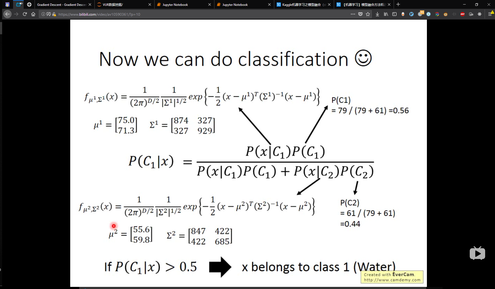
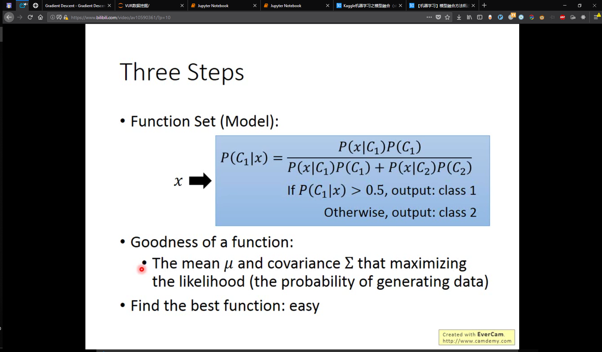
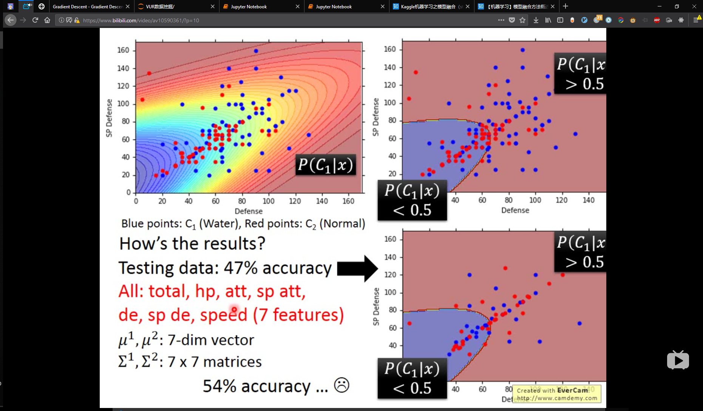
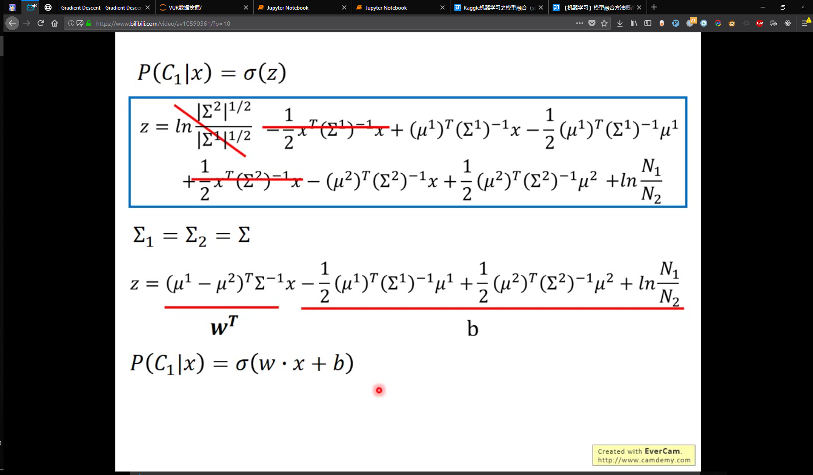
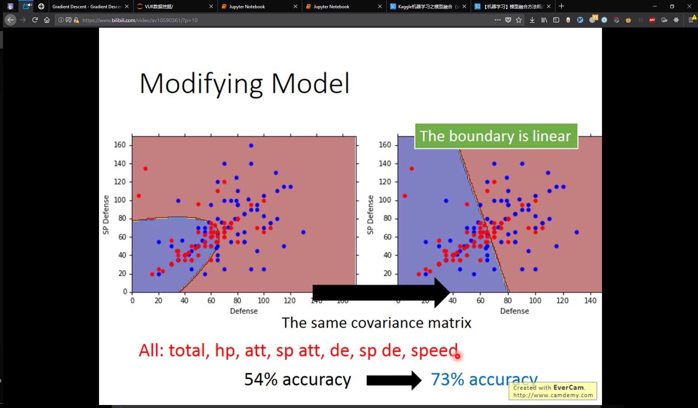
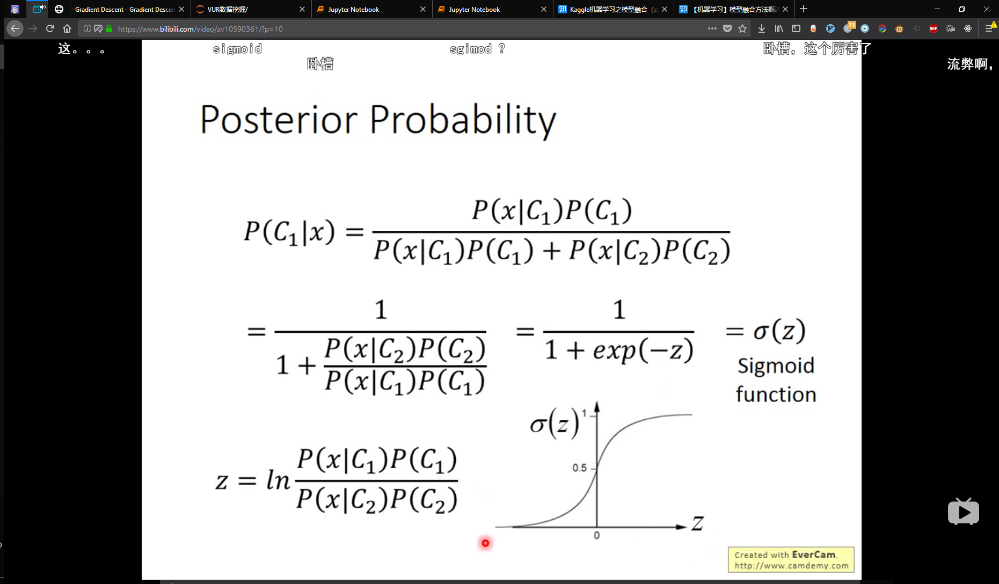


## 朴素贝叶斯naive bayes classifier 独立分布i.i.d 解决 binary分类

最大似然估计 

使用平均值，协方差 is the best function

选择自己的概率模型

### function model 为多维gassin distribution 

#### 各自有自己的covariant

#### 使用同一个covariant(常规操作)

convariant 使用样本数带权平均convariant1,convariant2 参考 Bishop chapter 4.2.2

不明白的请看数理统计方差分析，两个方差在两倍范围内可以看做是相同方差

boundary 变成了 linear的(对比convariant不同时)

使用全部feature 54%*(convariant不同时)->74%

### sigmoid function 用sigma符号表示

PRML上都有推导，自己推导一遍就可以了