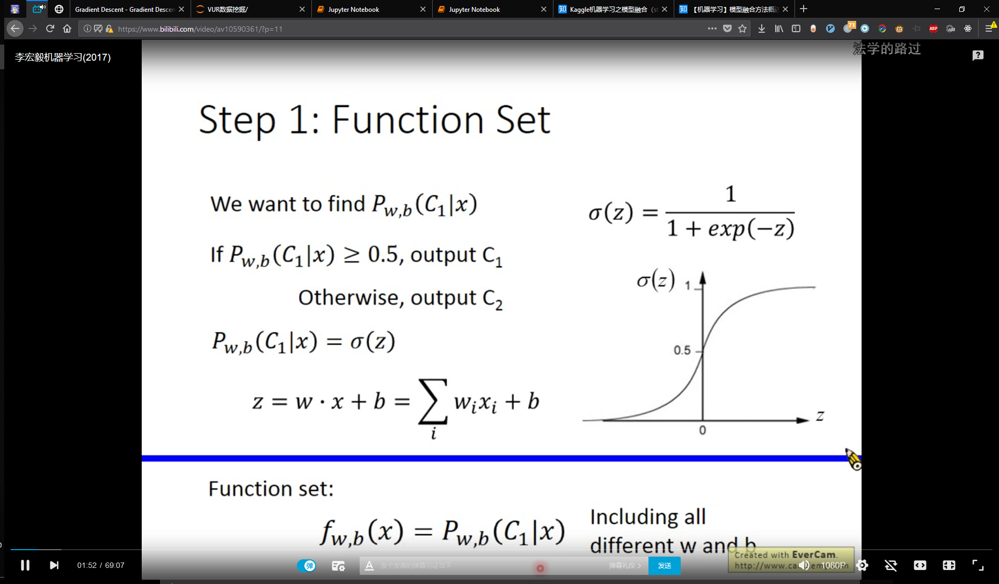
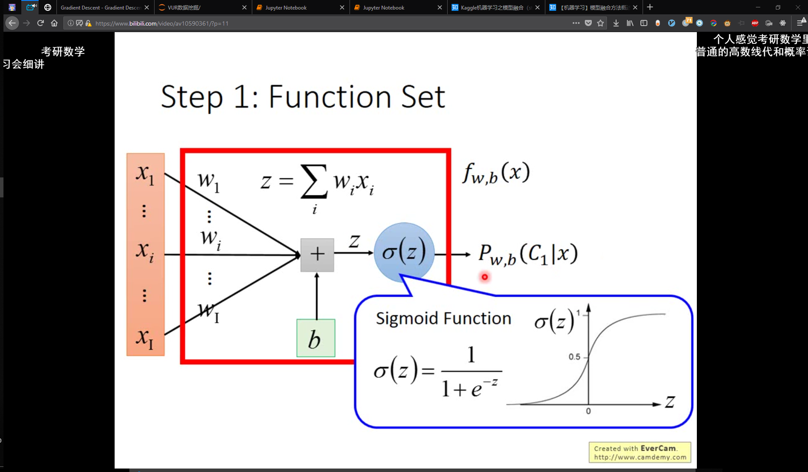
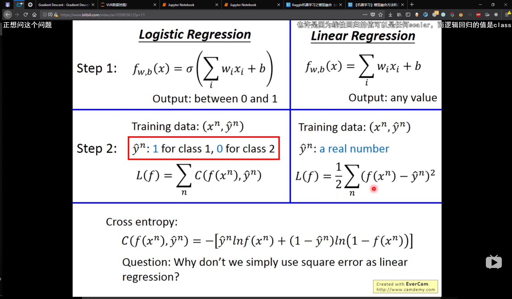
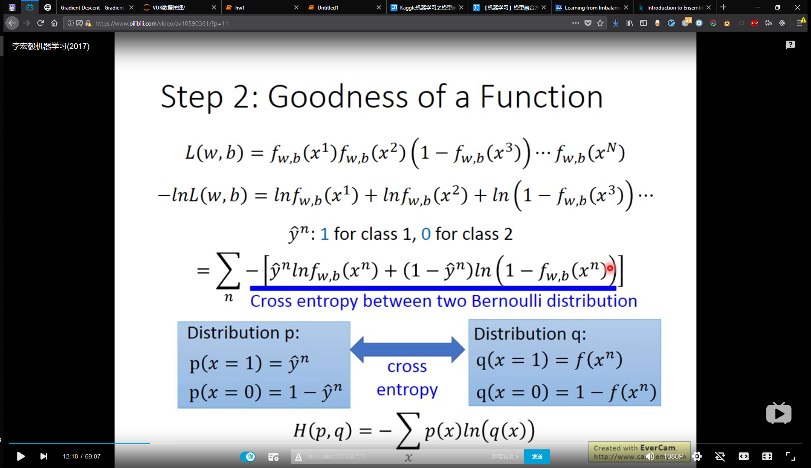
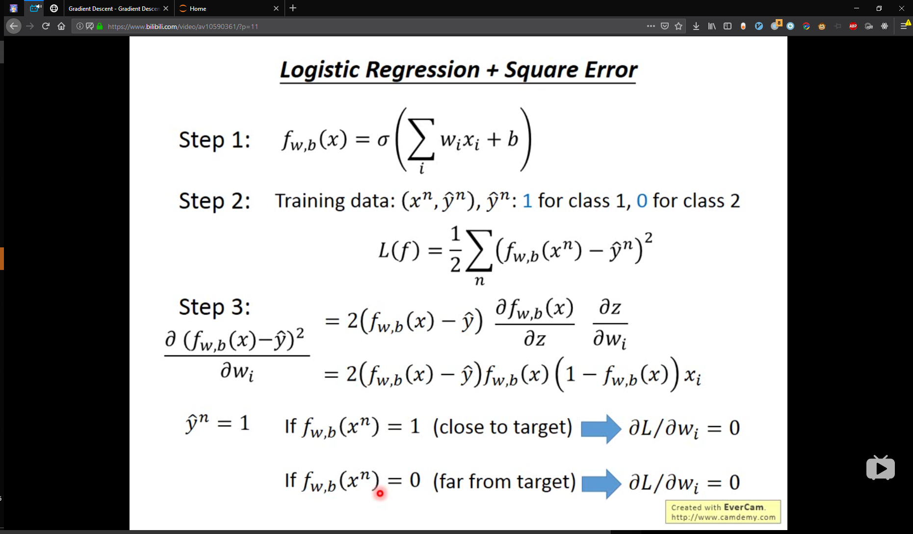
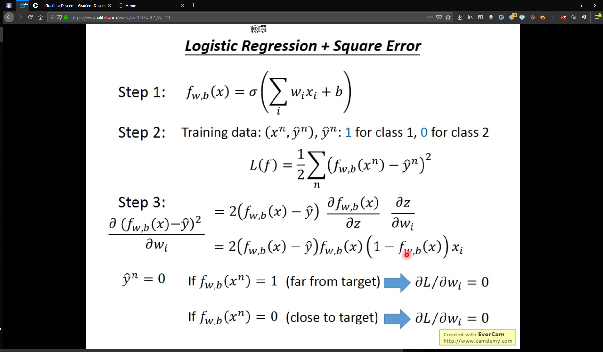
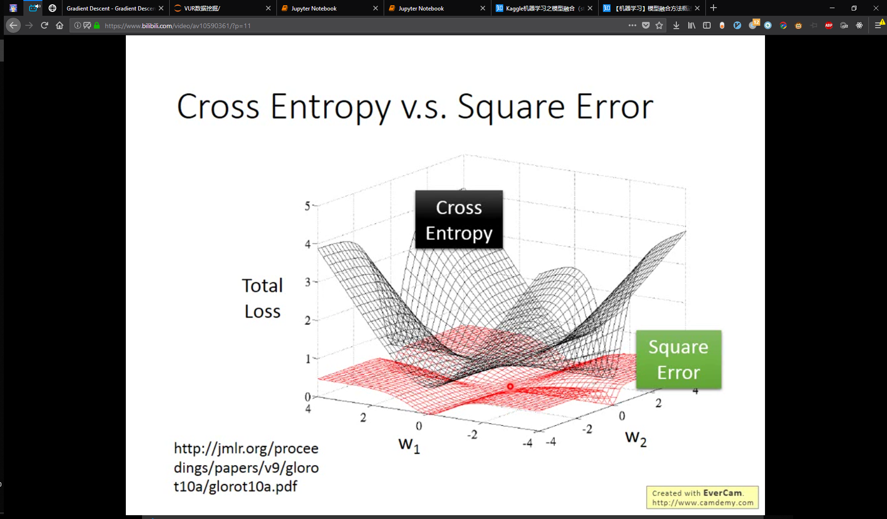
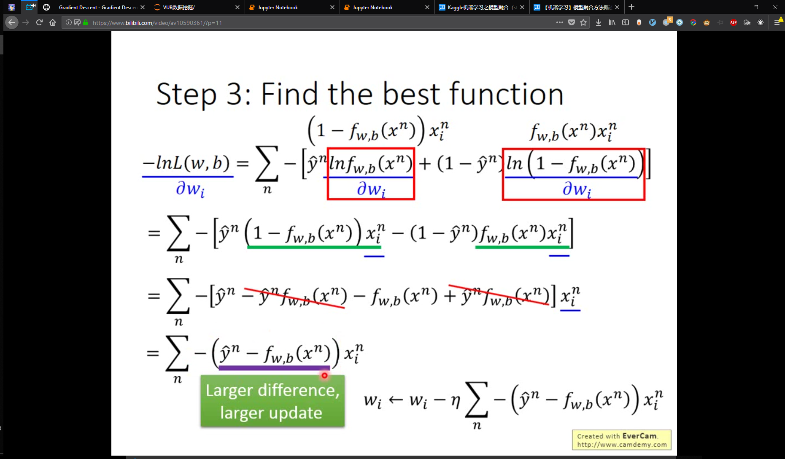
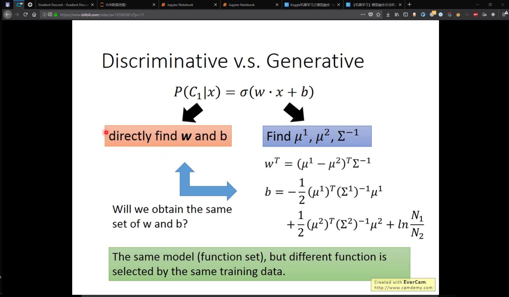
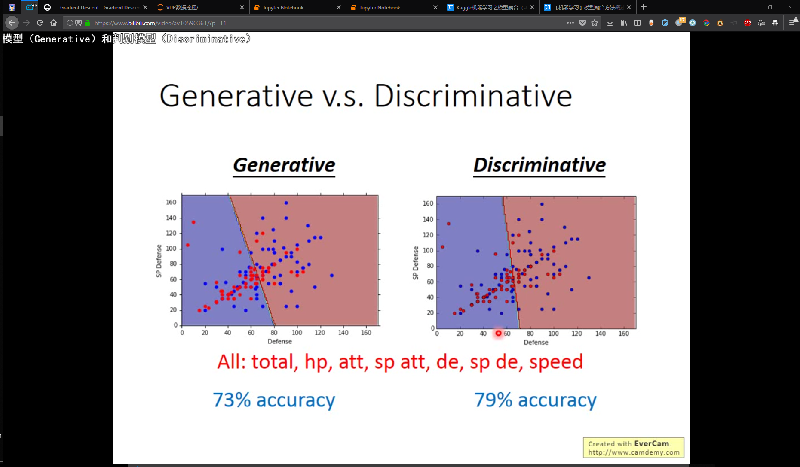

# P11 Logistic Regession

## Step1 Function set 01:51

Sigmoid，使得loss function对离群值不敏感

## Step2 Goodness of a function

### Cross entroy between two Bernoulli distribution 11:00

交叉熵代表两个分布有多接近，如果完全一样则为0

#### why not using square error in logistic regression, why cross entropy is important in logistic regression

使得target距离best的变化更明显,不陡峭即死

>TODO 
关于熵
 http://blog.csdn.net/rtygbwwwerr/article/details/50778098

### step3 find the best function gradient decence 求导 08:12

[]

# Naive bayss Discriminative v.s. Generative 判别模型 v.s. 生成模型 3100

当把generative的covaraint share时，function set 一样

Discriminative : logistic regression 无关假设的分布类型,可以约掉

Generative : gaussian distribution,假设了分布类型如 高斯 伯努利等

Discriminative is better

>example go here 

>当我们用sigmoid函数作为神经元的激活函数时，最好使用交叉熵代价函数来替代方差代价函数，以避免训练过程太慢

## tricks 24:00

直接用公式计算出loss function最小的点，把它设为初始点，就train得非常容易

### sigmoid function differential

$\frac{d\sigma (x)}{d(x)} = \sigma (x)\cdot (1-\sigma(x)).$