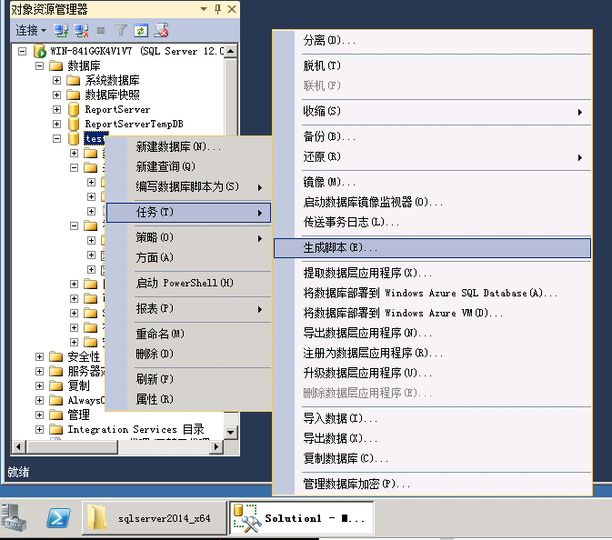
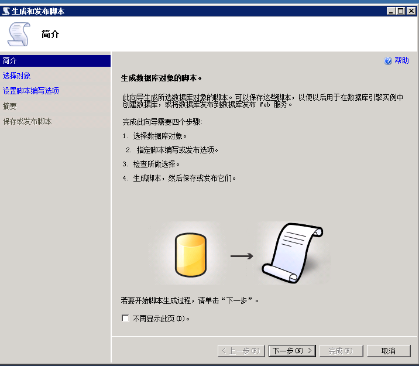
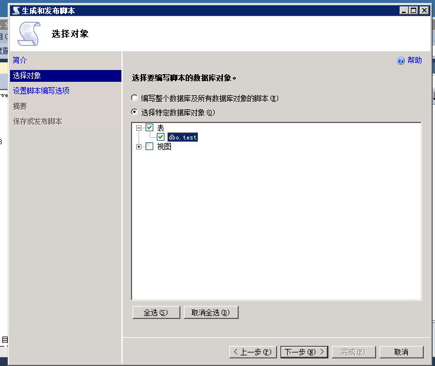
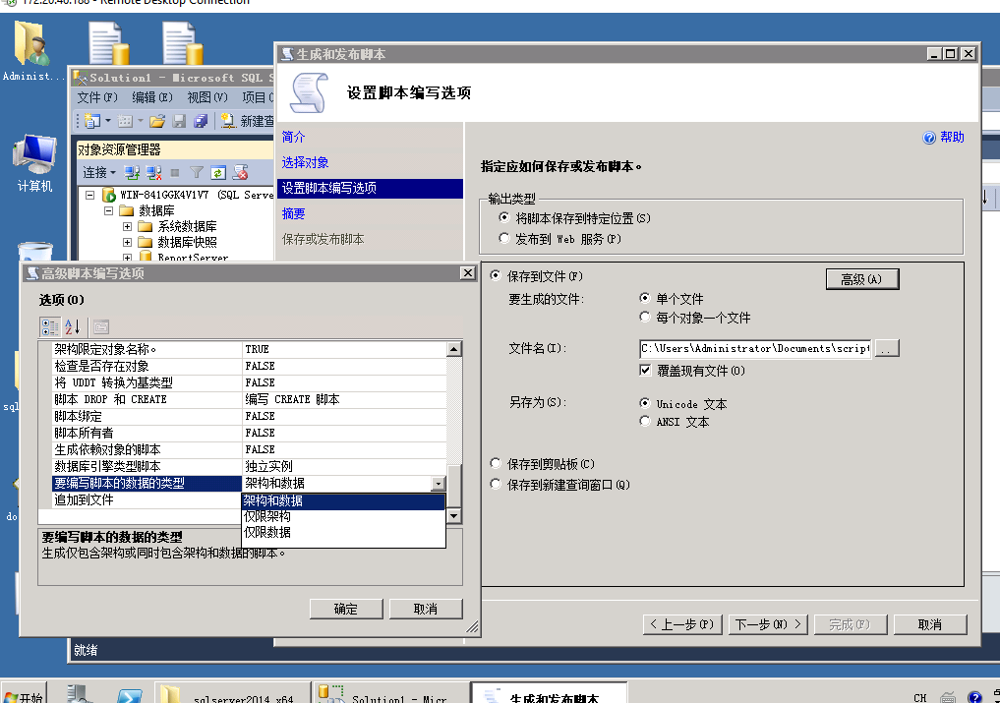
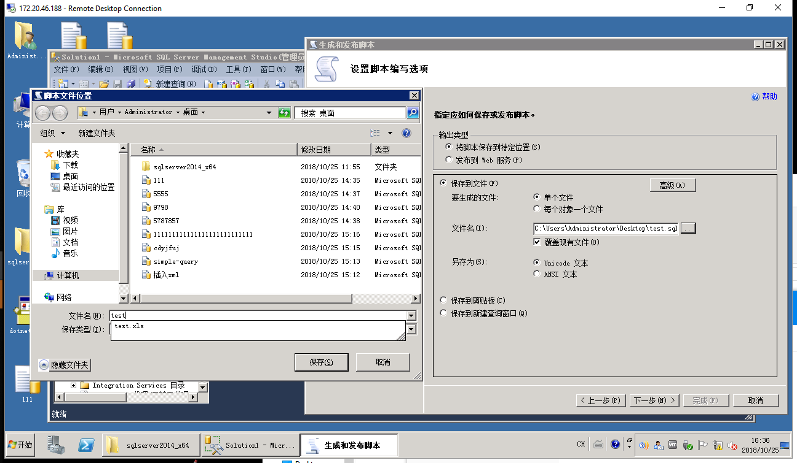
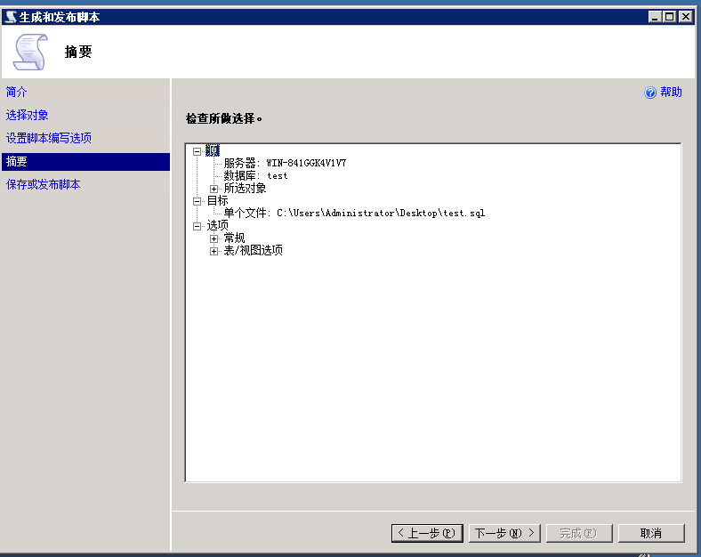
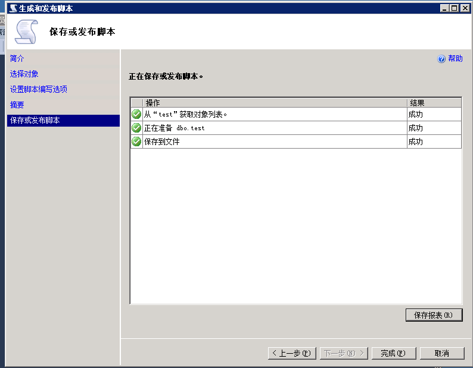
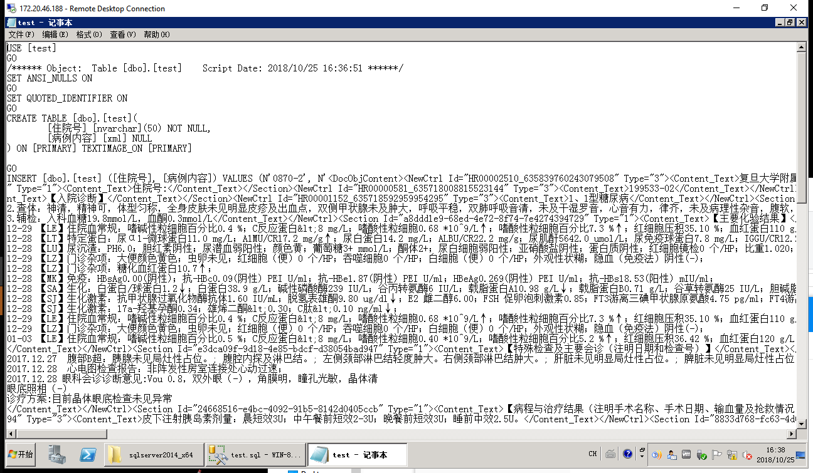

# sql server 表导出数据到sql脚本

如果是视图，那么先创建一张表，将视图结果存到表中。

>无法导出视图的数据，因为视图是没有数据的。

## 1. 右键点击数据库(以test数据库为例)-任务-生成脚本

## 2. 下一步

## 3. 选择需要导出的表-下一步

## 4. 高级-要编写脚本的数据和类型-选择‘架构和数据’-确定

## 5. 选择要保存的位置和文件-下一步

## 6. 下一步

## 7. 完成

## 8. 确认生成的脚本内容中有数据

### Author Xuekui,Zengjianjun

### Software

1. sql server 2014
2. windows server 2008r1
3. windows office 2016

### License 知识共享许可协议

本作品采用知识共享署名-非商业性使用 4.0 国际许可协议进行许可。
