# 导出视图到excel

## 1. 右键点击数据库(以test数据库为例)-任务-导出数据

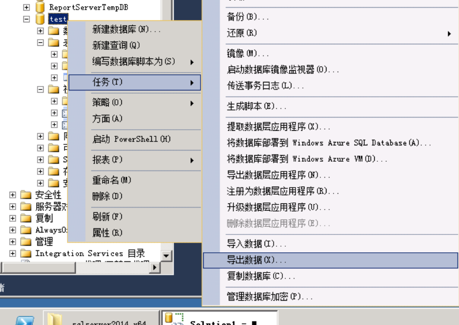

## 2. 选择从SQL Server Native Client 11.0导出，输入验证，下一步

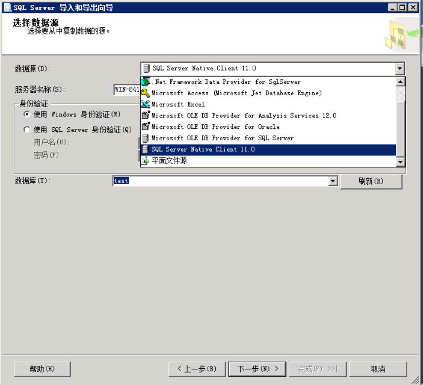

## 3. 选择导出到Microsoft Excel文件

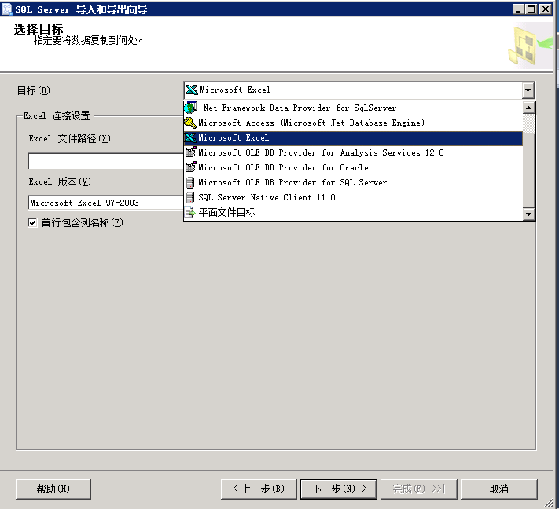

## 4. 选择一个位置及命名，下一步

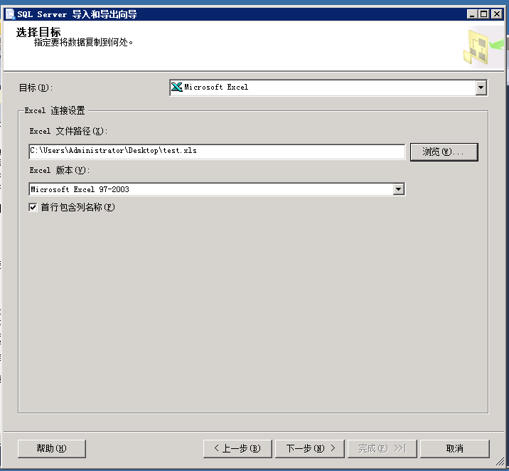

## 5. 选择‘复制一个或多个表或视图的数据’，下一步

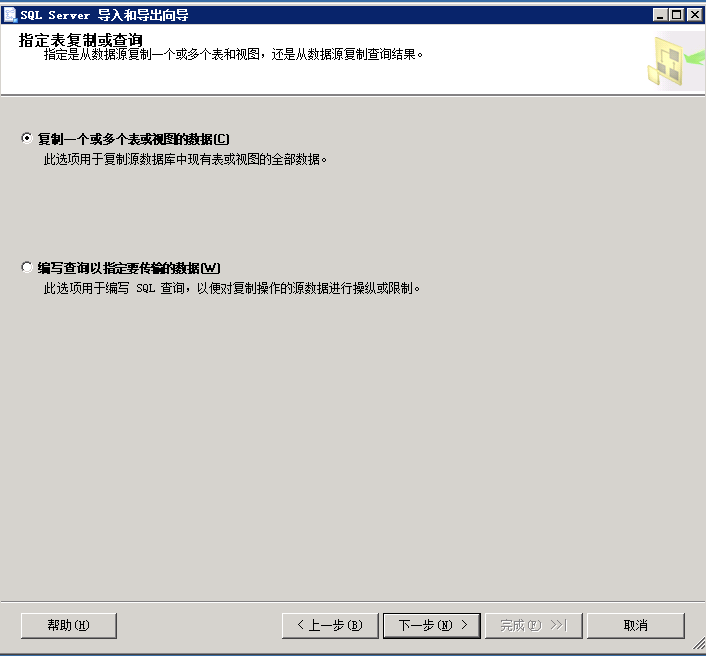

## 6. 选择视图，下一步

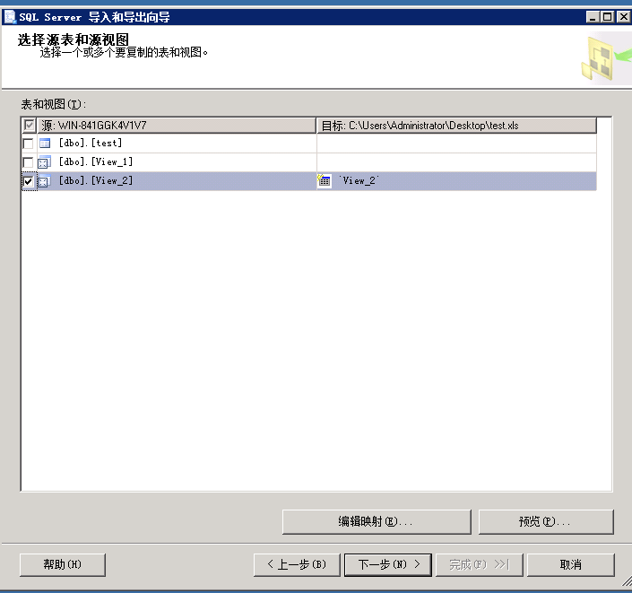

## 7. 下一步

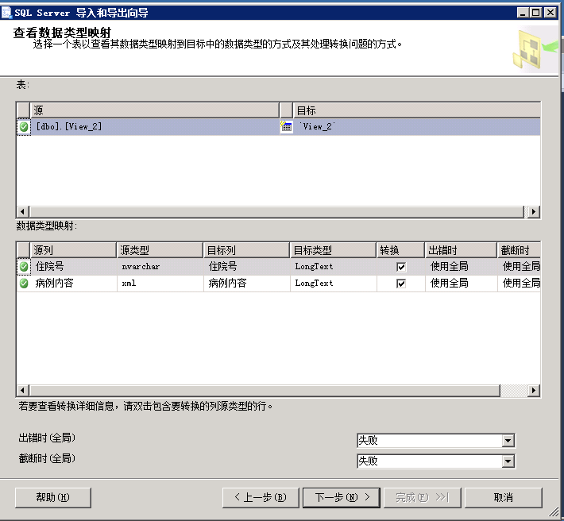

## 8. 下一步

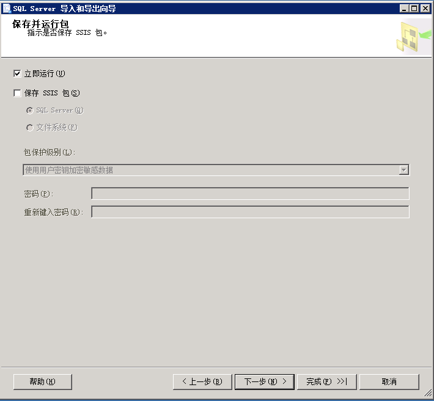

## 9. 完成

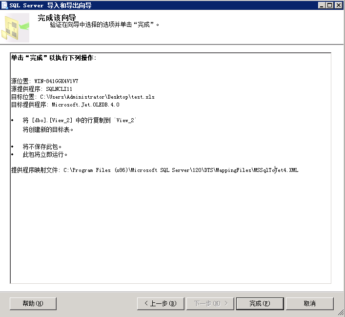

## 10. 确认excel内容，是否有截断，xml内换行是否有保存，是否有跨行

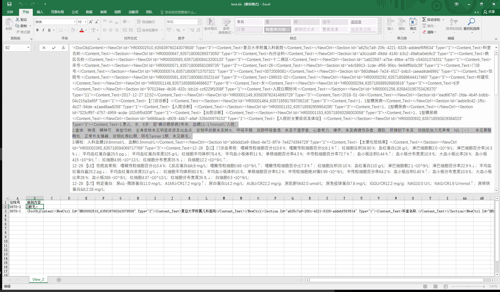

## 注意的一些问题

在视图检查列名，避免导出列名有误，如下图
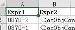

### Author Xuekui,Zengjianjun

### Software

1. sql server 2014
2. windows server 2008r1
3. windows office 2016

### License 知识共享许可协议

本作品采用知识共享署名-非商业性使用 4.0 国际许可协议进行许可。

