# sql server 视图导出数据到sql脚本

一、导出视图到表

二、导出表到sql脚本

## 一、视图转换成表

```sql
// https://blog.csdn.net/xxd851116/article/details/5950321
oracle :
create table tablename as select * from viewname

sqlserver:
select * into tablename from viewname 
```

### 1. 顶部菜单栏-文件-新建-使用当前连接的查询

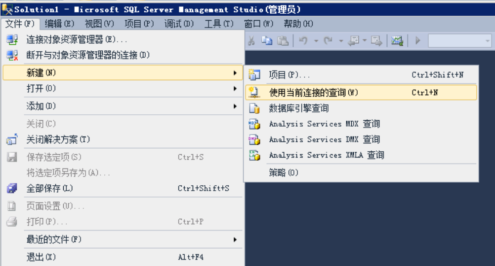

### 2. 编写-执行

```sql
--sqlserver--
--刚刚创建的视图可能会不提示补全，请尝试--
--重新打开sql客户端--
--检查第一步中选择‘使用当前连接的查询’，而不是‘数据库引擎查询’--
select * into result_table from my_view
```

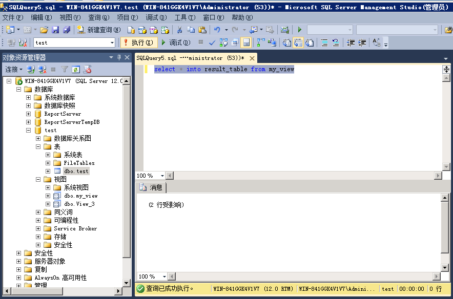

### 3. 右键点击表-刷新-查看结果

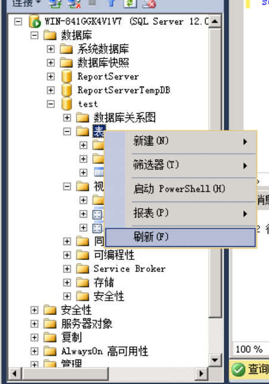

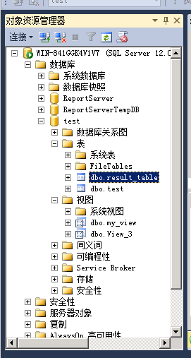

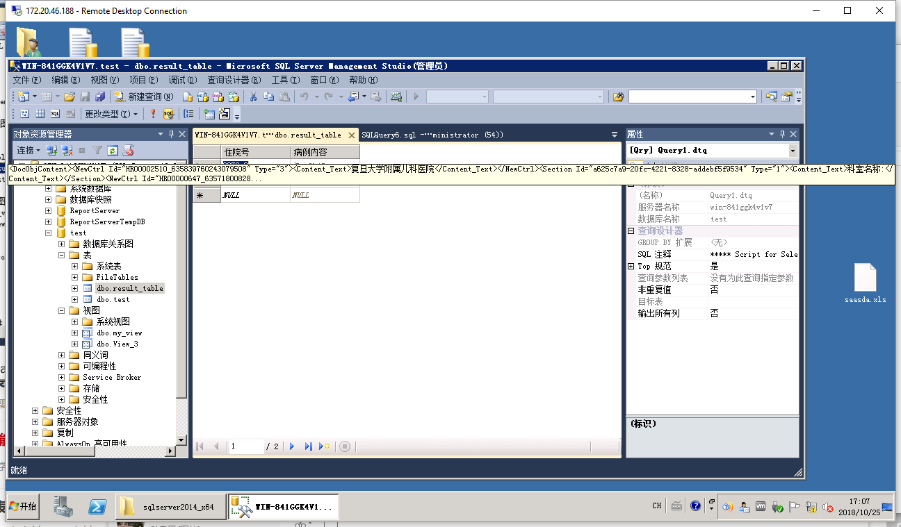


## 二、导出表到sql脚本

### 1. 右键点击数据库(以test数据库为例)-任务-生成脚本

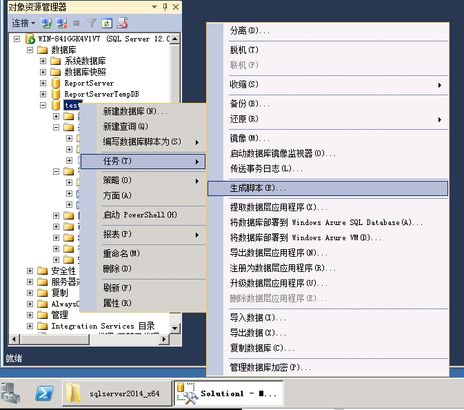

### 2. 下一步

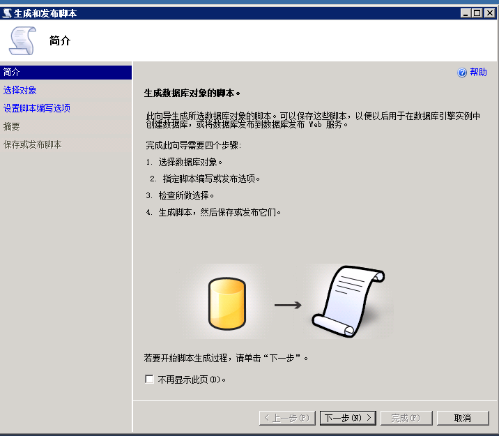

### 3. 选择需要导出的表-下一步

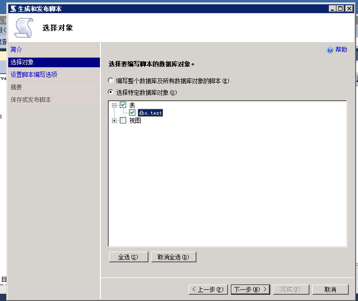

### 4. 高级-要编写脚本的数据和类型-选择‘架构和数据’-确定

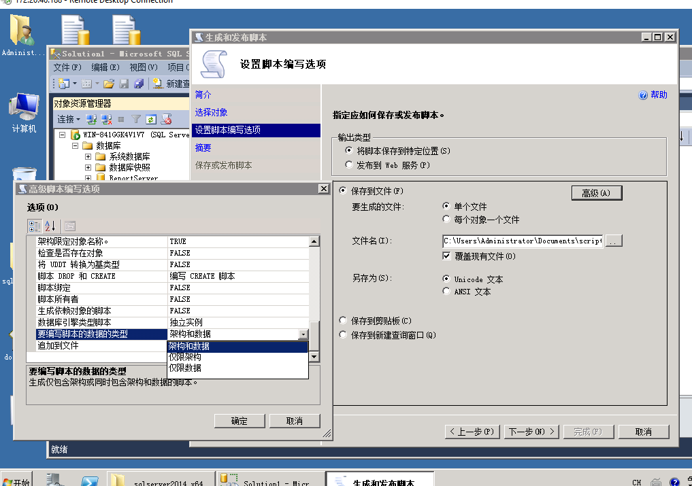

### 5. 选择要保存的位置和文件-下一步

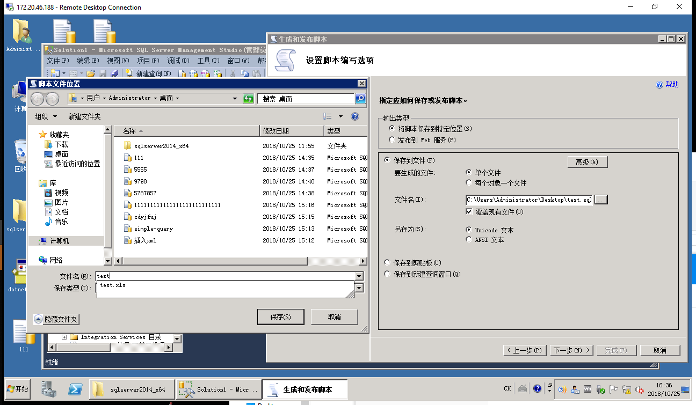

### 6. 下一步

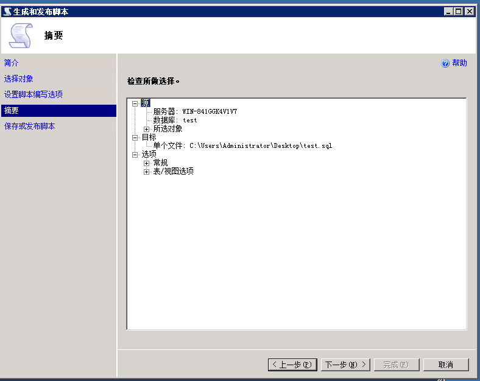

### 7. 完成

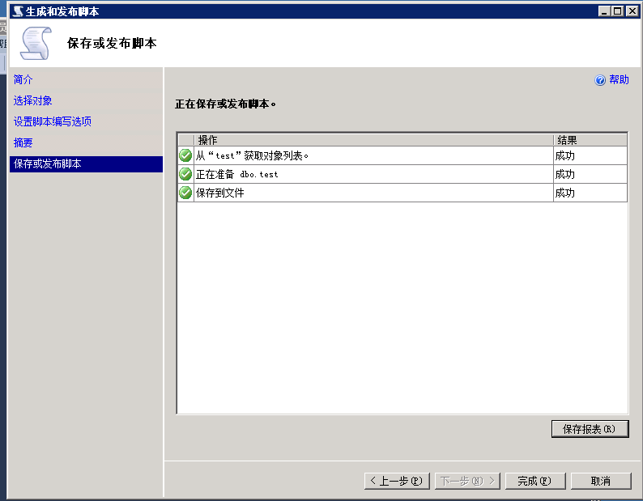

### 8. 确认生成的脚本内容中有数据

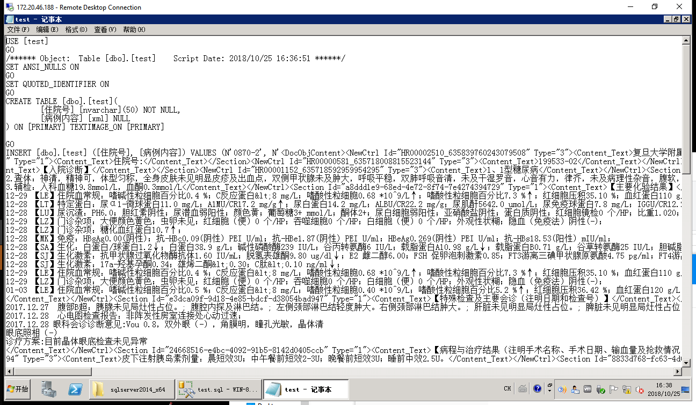

## 三、Other

### Author Xuekui,Zengjianjun

### Software

1. sql server 2014
2. windows server 2008r1
3. windows office 2016

### License 知识共享许可协议

本作品采用知识共享署名-非商业性使用 4.0 国际许可协议进行许可。
